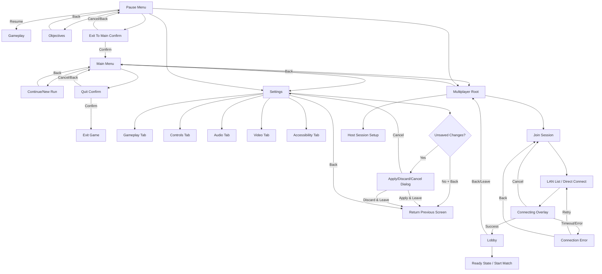

# T07 — High-Fidelity Menu and Flow Concepts

Status: ready_for_review  
Plan ID: `ui-overhaul-2026-02-23`  
Task ID: `T07`  
Date: 2026-02-23

## 1) Purpose and scope
- Deliver concept-ready menu direction for the new immersive UI across:
  - Main menu
  - Pause menu
  - Settings
  - Multiplayer flows
- Define cohesive thematic presentation and clear navigation behavior.
- Cover primary and secondary states, including back/cancel/error outcomes.

## 2) Visual concept direction (menu family)

Theme keywords:
- Oppressive calm, analog signal decay, constrained readability under tension.
- Diegetic-feel overlays without obscuring core labels.
- Functional hierarchy first, atmosphere second.

Token alignment (from T04/T05):
- Spacing/typography/color/motion derive from `src/ui_style_tokens.h`.
- Focus and selection transitions use fast response timing (`UiMotion::kPulseFastSec` class behavior).
- Enter/exit of panels use normal/fast timing split (enter slower than exit).

Global composition rules:
- Left-aligned action stack + right-side contextual panel for details/previews.
- One dominant focal action per screen state.
- Persistent footer hint row for input affordances (`Confirm`, `Back`, `Cancel`, `Apply`).
- Error and warning surfaces use distinct semantic treatment and never rely on color alone.

## 3) Screen concepts

### 3.1 Main menu
Primary state:
- Hero title treatment with subtle atmospheric drift.
- Vertical primary actions:
  - Continue
  - New Run
  - Multiplayer
  - Settings
  - Credits
  - Quit
- Context panel shows save/session summary for currently focused action.

Secondary states:
- No-save fallback: `Continue` replaced by disabled state + "No active run" note.
- Confirm quit dialog (modal): `Quit` -> `Confirm Quit` / `Cancel`.
- First-launch advisory panel for brightness/audio baseline setup.

Interaction notes:
- Focus shift updates context panel immediately.
- Back from root keeps focus on last valid action; no hidden dead-end.

### 3.2 Pause menu
Primary state:
- Semi-opaque freeze panel over blurred gameplay frame.
- Vertical actions:
  - Resume
  - Objectives
  - Settings
  - Return to Lobby (multiplayer only)
  - Exit to Main Menu

Secondary states:
- Unsaved progress warning before `Exit to Main Menu`.
- Objective detail subpanel (scrollable content area).
- Network host migration notice (if session authority changes while paused).

Interaction notes:
- `Resume` is default highlighted action.
- Back from pause root returns to gameplay immediately.
- Any blocking network/error modal traps within modal scope until resolved/canceled.

### 3.3 Settings
Primary state:
- Tab groups:
  - Gameplay
  - Controls
  - Audio
  - Video
  - Accessibility
- Two-column layout:
  - Left: setting list for active tab.
  - Right: current value + help/impact description.

Secondary states:
- Dirty-state banner (`Unsaved changes`) with actions `Apply`, `Revert`, `Back`.
- Confirm dialog on leaving with unsaved changes:
  - `Apply & Leave`
  - `Discard & Leave`
  - `Cancel`
- Validation warning examples:
  - Keybind conflict
  - Unsupported display mode
  - Invalid volume/device route

Interaction notes:
- `Back` from settings root checks dirty-state before navigation.
- Invalid entries focus first invalid field and present inline correction guidance.

### 3.4 Multiplayer
Primary state:
- Entry split:
  - Host Session
  - Join Session
- Join path supports:
  - LAN discover list
  - Direct code/IP input
- Session card list includes host name, ping quality, player count, lock status.

Secondary states:
- Join in-progress overlay with cancel action.
- Password-protected room prompt.
- Lobby pre-match panel (readiness, loadout/slot summary, start permission state).

Interaction notes:
- Back from Join/Host setup returns to Multiplayer root preserving prior input where safe.
- Cancel during connect returns to previous stable state with clear status message.

## 4) Navigation flow map

Back/cancel/error behavior contract:
- Every non-root screen defines a deterministic previous state target.
- Cancel always resolves to last stable non-error state.
- Error states provide both immediate retry and explicit back-out path.
- No flow branch ends without either `Confirm`, `Back`, `Cancel`, or `Retry`.

## 5) Primary + secondary state coverage checklist
- Main menu root + quit confirm + no-save fallback.
- Pause root + objective details + exit confirm + network interruption notice.
- Settings tabs + dirty-state exit + validation error handling.
- Multiplayer host/join + connecting/cancel + connection error + lobby state.

## 6) Accessibility and usability considerations for concept review
- Keyboard/controller navigability is preserved for all actions shown in flow map.
- Focus visibility remains explicit on every selectable item.
- Critical actions requiring confirmation include clear text labels (not color-only signaling).
- Error dialogs present fix-forward guidance and maintain predictable back path.
- Layout strategy is designed to reflow for narrow widths while retaining action discoverability.

## 7) Concept review approval block

Review package status: ready_for_review

| Role | Name | Decision | Date | Notes |
|---|---|---|---|---|
| UI Artist |  | Approve / Request changes |  |  |
| UX Designer |  | Approve / Request changes |  |  |
| UI Engineer |  | Approve / Request changes |  |  |
| Gameplay Engineer |  | Approve / Request changes |  |  |
| Network Engineer |  | Approve / Request changes |  |  |
| Accessibility Specialist |  | Approve / Request changes |  |  |
| Product/Director |  | Approve / Request changes |  |  |

Approval outcome (to be completed during review):
- Final decision: Pending
- Blocking issues: None recorded yet
- Follow-up actions: To be captured in review notes
